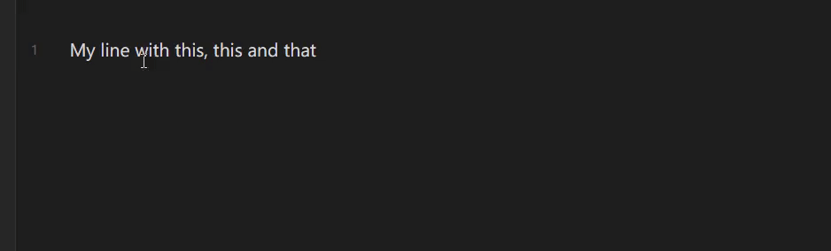
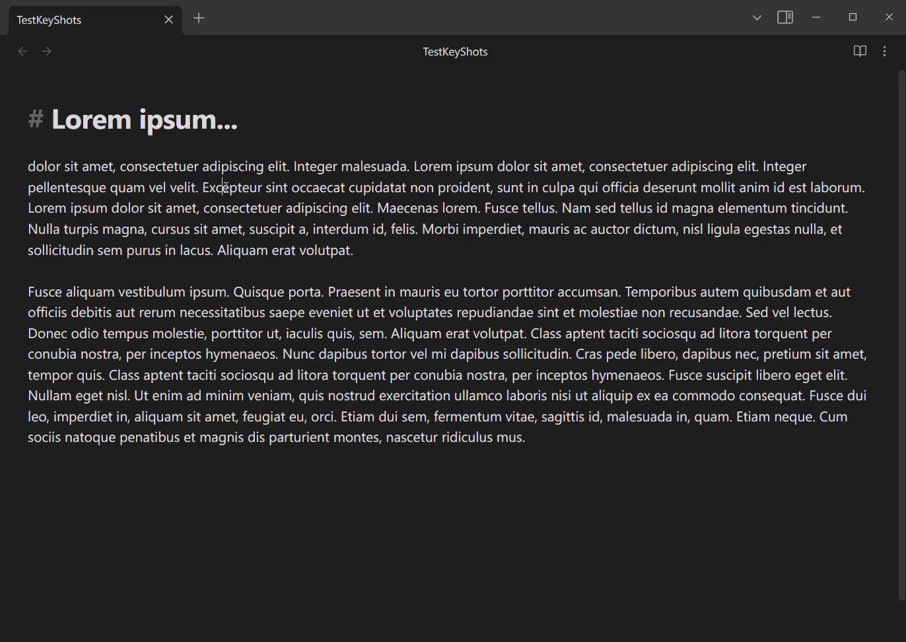

<h1 align=center>Keyshots</h1>

Adds classic hotkey/shortcuts commands from popular IDEs like Visual Studio Code or JetBrains Family. Adds actions like...

...move line up or down (<kbd>Shift + Alt + ↑</kbd> / <kbd>Shift + Alt + ↓</kbd>) ...

...add caret cursors up or down (<kbd>Ctrl + Alt + ↑</kbd> / <kbd>Ctrl + Alt + ↓</kbd>) ...

...insert lines above or below (<kbd>Shift + Enter</kbd> / <kbd>Ctrl + Shift + Enter</kbd>) ...

...duplicate text or selection (<kbd>Ctrl + D</kbd>) ...

...change readable line length inside editor (<kbd>Ctrl + Shift + R</kbd>) ...

...**And much more**!