<h1 align=center>Keyshots</h1>

<i>Turn your Obsidian into compact text editor!</i>

---

Keyshots is an [Obsidian](https://obsidian.md) plugin that adds classic hotkey/shortcuts commands from popular IDEs like Visual Studio Code or JetBrains Family. 

Apart from that, i want to add as much my custom and usefull commands as possible!

Adds actions like...

...move line up or down (**Visual Studio Code**: <kbd>Alt + ↑</kbd> / <kbd>Alt + ↓</kbd>; **Jetbrains**: <kbd>Shift + Alt + ↑</kbd> / <kbd>Shift + Alt + ↓</kbd>) ...

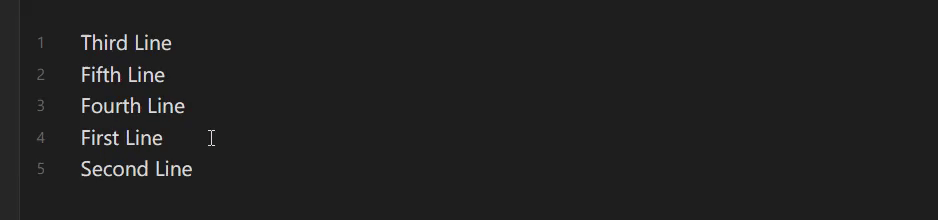

...add caret cursor up or down (<kbd>Ctrl + Alt + ↑</kbd> / <kbd>Ctrl + Alt + ↓</kbd>) ...

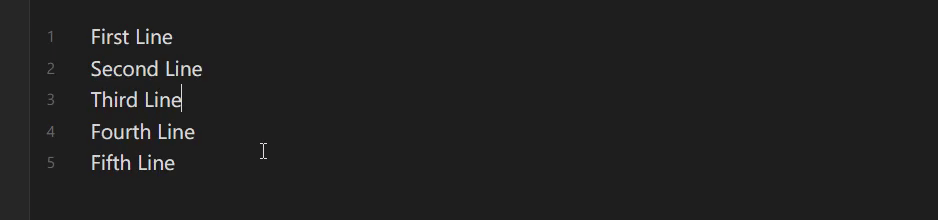

...insert lines above or below (<kbd>Shift + Enter</kbd> / <kbd>Ctrl + Shift + Enter</kbd>) ...

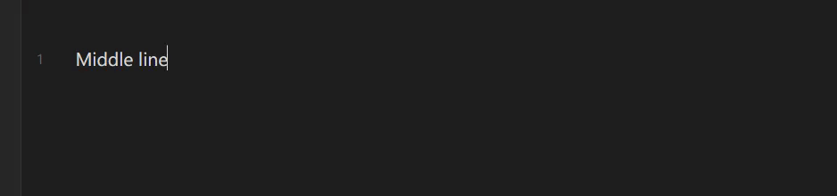

...duplicate line up or down (**Visual Studio Code duplication style**) (<kbd>Shift + Alt + ↑</kbd> / <kbd>Shift + Alt + ↓</kbd>) ...

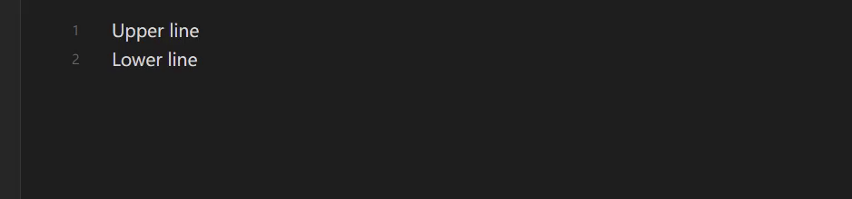

...duplicate text or selection (**Jetbrains duplication style**) (<kbd>Ctrl + D</kbd>) ...

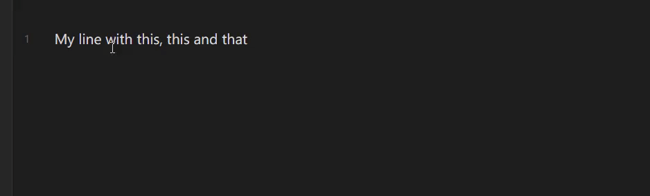

...toggle readable line length inside editor (<kbd>Ctrl + Shift + R</kbd>) ...

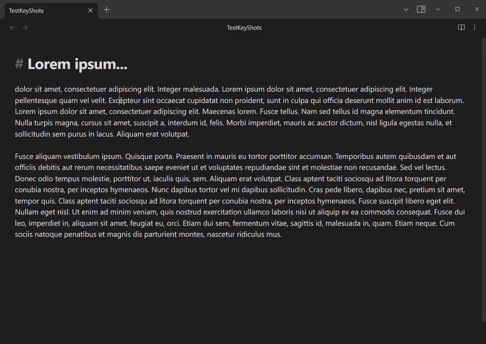

...toggle line numbers inside editor (<kbd>Ctrl + Shift + L</kbd>) ...

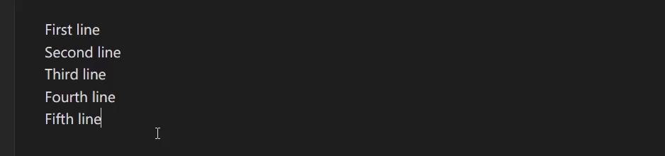

...encode or decode URI text (<kbd>Ctrl + Alt + U</kbd>) ...

...transform selected texts to Lowercase (<kbd>Alt + L</kbd>) / Uppercase (<kbd>Alt + U</kbd>) / Titlecase (<kbd>Alt + C</kbd>) ...

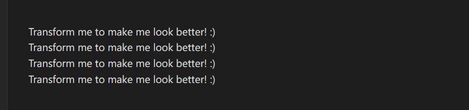

...join selected lines to one line (<kbd>Crtl + Shift + J</kbd>) ...

...split selections on new line (<kbd>Alt + S</kbd>) and trim selection (<kbd>Alt + T</kbd>) ...

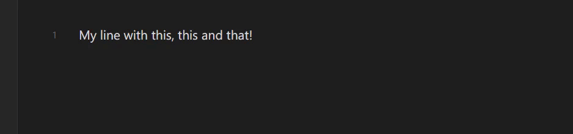

...sort selected lines with alphanumeric comparison (<kbd>Ctrl + Shift + S</kbd>) ...

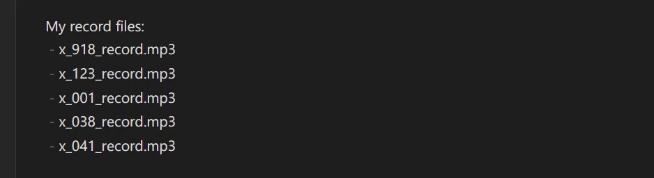

...transform selections to or from snakecase (<kbd>Alt + -</kbd>) ...

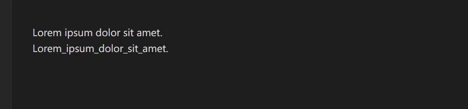

...**And more commands comming soon**!

## 🎛️ Settings

Added in version 1.2.0, adds ability to choose default hotkeys mappings by IDEs presets.

Now you can choose from these IDEs:

- Clear (everything blank; set in default when keyshots are installed) (**NEW IN** 1.4.0)
- Visual Studio Code
- JetBrains IDEs Family (IntelliJ IDEA, PyCharm, WebStorm, ... )
- Microsoft Visual Studio (**NEW IN** 1.3.0)

## ⚠️ Read before usage:

- `Duplicate line or selection (JetBrains IDEs)` command is defaultly on the same hotkey as `delete line` command (<kbd>Ctrl + D</kbd>). That is because JetBrains IDEs have it the same way. Before usage change this action hotkey based on your preference or basically clear `Delete line` command!

- For most of these commands, it requires more than one undo/revert actions, because these commands contain more than one instruction.