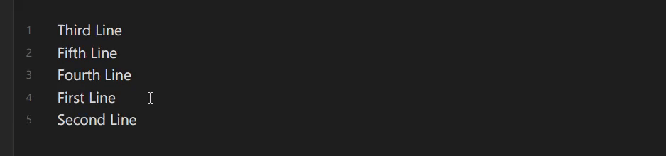
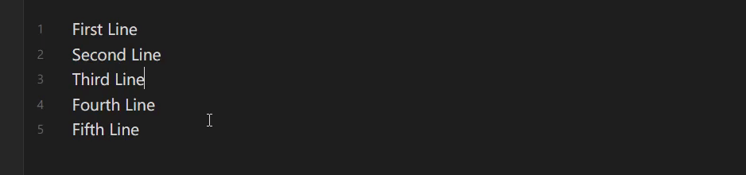
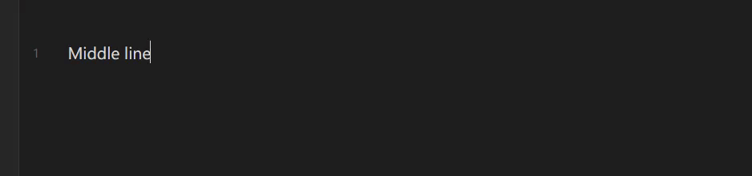
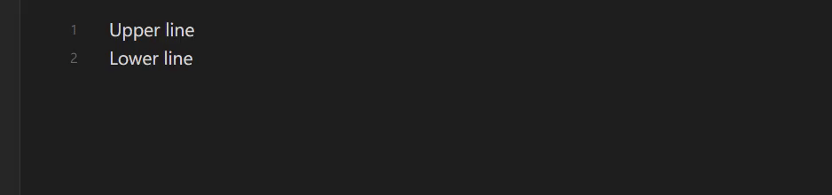
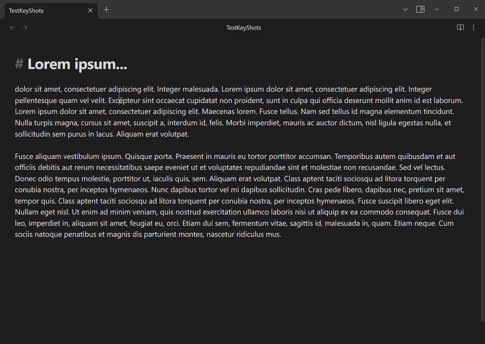
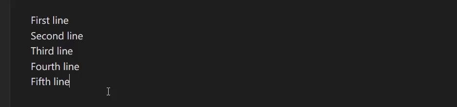
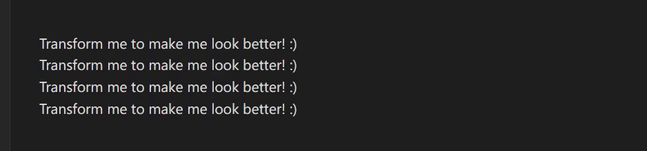
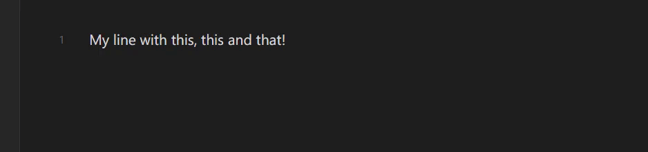
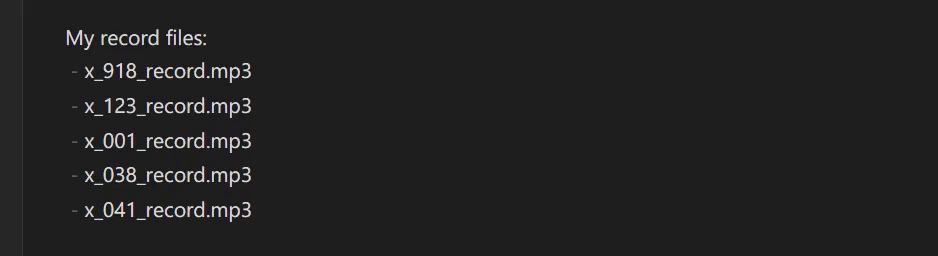
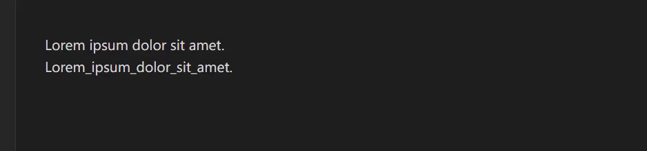

Keyshots is an [Obsidian](https://obsidian.md) plugin that adds classic hotkey/shortcuts commands from popular IDEs like
Visual Studio Code or JetBrains Family.

## 🌠 Visual examples

Keyshots adds actions like move line up or down...

...add caret cursor up or down...

...insert lines above or below...

...duplicate line up or down...

...duplicate text or selection...

...toggle readable line length inside editor...

...toggle line numbers inside editor...

...encode or decode URI text...

...transform selected texts to lowercase, uppercase or titlecase...

...join selected lines to one line...

...split selections on new line and trim selection...

...sort selected lines with alphanumeric comparison...

...transform selections to or from snakecase...

...**and much more commands to explore!**  *(And more are comming soon)*

## ⌨️ List of Keyshots commands with IDE Mappings

Here is a full list of all Keyshots commands with mappings of hotkeys that are available. If any of hotkey for IDE action is missing, Keyshots mappings
hotkey is used instead *(This behavior can be changed in settings)*.

| Hotkeys | Keyshots Default Mappings | Visual Studio Code | JetBrains IDEs | Microsoft Visual Studio |
| --- | --- | --- | --- | --- |
| `Duplicate line up (Visual Studio Code)` | <kbd>Shift</kbd> + <kbd>Alt</kbd> + <kbd>↑</kbd> | <kbd>Shift</kbd> + <kbd>Alt</kbd> + <kbd>↑</kbd> |  |  |
| `Duplicate line down (Visual Studio Code)` | <kbd>Shift</kbd> + <kbd>Alt</kbd> + <kbd>↓</kbd> | <kbd>Shift</kbd> + <kbd>Alt</kbd> + <kbd>↓</kbd> |  |  |
| `Duplicate selection or line (JetBrains IDEs)` | <kbd>Ctrl</kbd> + <kbd>Alt</kbd> + <kbd>D</kbd> |  | <kbd>Ctrl</kbd> + <kbd>D</kbd> | <kbd>Ctrl</kbd> + <kbd>D</kbd> |
| `Insert line above` | <kbd>Ctrl</kbd> + <kbd>Shift</kbd> + <kbd>Enter</kbd> | <kbd>Ctrl</kbd> + <kbd>Shift</kbd> + <kbd>Enter</kbd> | <kbd>Ctrl</kbd> + <kbd>Alt</kbd> + <kbd>Enter</kbd> | <kbd>Ctrl</kbd> + <kbd>Enter</kbd> |
| `Insert line below` | <kbd>Shift</kbd> + <kbd>Enter</kbd> | <kbd>Ctrl</kbd> + <kbd>Enter</kbd> | <kbd>Shift</kbd> + <kbd>Enter</kbd> | <kbd>Shift</kbd> + <kbd>Enter</kbd> |
| `Join selected lines` | <kbd>Ctrl</kbd> + <kbd>Shift</kbd> + <kbd>J</kbd> | <kbd>Ctrl</kbd> + <kbd>J</kbd> | <kbd>Ctrl</kbd> + <kbd>Shift</kbd> + <kbd>J</kbd> |  |
| `Move selected lines down` | <kbd>Alt</kbd> + <kbd>↓</kbd> | <kbd>Alt</kbd> + <kbd>↓</kbd> | <kbd>Shift</kbd> + <kbd>Alt</kbd> + <kbd>↓</kbd> | <kbd>Alt</kbd> + <kbd>↓</kbd> |
| `Move selected lines up` | <kbd>Alt</kbd> + <kbd>↑</kbd> | <kbd>Alt</kbd> + <kbd>↑</kbd> | <kbd>Shift</kbd> + <kbd>Alt</kbd> + <kbd>↑</kbd> | <kbd>Alt</kbd> + <kbd>↑</kbd> |
| `Reverse selected lines` | <kbd>Alt</kbd> + <kbd>R</kbd> |  |  |  |
| `Shuffle selected lines` | <kbd>Ctrl</kbd> + <kbd>Shift</kbd> + <kbd>Alt</kbd> + <kbd>S</kbd> |  |  |  |
| `Sort selected lines` | <kbd>Ctrl</kbd> + <kbd>Shift</kbd> + <kbd>S</kbd> |  |  |  |
| `Indent` | <kbd>Alt</kbd> + <kbd>]</kbd> |  |  |  |
| `Unindent` | <kbd>Alt</kbd> + <kbd>[</kbd> |  |  |  |
| `Better insert callout` | <kbd>Shift</kbd> + <kbd>Alt</kbd> + <kbd>C</kbd> |  |  |  |
| `Insert code block` | <kbd>Ctrl</kbd> + <kbd>Shift</kbd> + <kbd>`</kbd> |  |  |  |
| `Insert ordinal numbering` | <kbd>Shift</kbd> + <kbd>Alt</kbd> + <kbd>N</kbd> |  |  |  |
| `Insert Table` | <kbd>Shift</kbd> + <kbd>Alt</kbd> + <kbd>T</kbd> |  |  |  |
| `Change Keyshots preset` | <kbd>Ctrl</kbd> + <kbd>Shift</kbd> + <kbd>P</kbd> |  |  |  |
| `Open Keyshots settings tab` | <kbd>Ctrl</kbd> + <kbd>Alt</kbd> + <kbd>,</kbd> |  |  |  |
| `Switch Keyshots case sensitivity` | <kbd>Ctrl</kbd> + <kbd>Alt</kbd> + <kbd>I</kbd> |  |  |  |
| `Switch 'inline title' setting` | <kbd>Ctrl</kbd> + <kbd>Alt</kbd> + <kbd>T</kbd> |  |  |  |
| `Switch 'line numbers' setting` | <kbd>Ctrl</kbd> + <kbd>Alt</kbd> + <kbd>N</kbd> |  |  |  |
| `Switch 'readable line length' setting` | <kbd>Ctrl</kbd> + <kbd>Alt</kbd> + <kbd>R</kbd> |  |  |  |
| `Reopen current note` | <kbd>Alt</kbd> + <kbd>Q</kbd> |  |  |  |
| `Open developer tools` | <kbd>F12</kbd> |  |  |  |
| `Toggle focus mode` | <kbd>Ctrl</kbd> + <kbd>Alt</kbd> + <kbd>F</kbd> |  |  |  |
| `Duplicate tab` | <kbd>Ctrl</kbd> + <kbd>Alt</kbd> + <kbd>D</kbd> |  |  |  |
| `Close all foldable callouts` | <kbd>Shift</kbd> + <kbd>Alt</kbd> + <kbd>L</kbd> |  |  |  |
| `Open all foldable callouts` | <kbd>Shift</kbd> + <kbd>Alt</kbd> + <kbd>O</kbd> |  |  |  |
| `Toggle all callouts fold state` | <kbd>Shift</kbd> + <kbd>Alt</kbd> + <kbd>K</kbd> |  |  |  |
| `Toggle case (JetBrains)` | <kbd>Ctrl</kbd> + <kbd>Shift</kbd> + <kbd>U</kbd> |  | <kbd>Ctrl</kbd> + <kbd>Shift</kbd> + <kbd>U</kbd> |  |
| `Transform selections to lowercase` | <kbd>Alt</kbd> + <kbd>U</kbd> |  |  | <kbd>Ctrl</kbd> + <kbd>Shift</kbd> + <kbd>U</kbd> |
| `Replace by Regular Expression (Regex)` | <kbd>Ctrl</kbd> + <kbd>Alt</kbd> + <kbd>H</kbd> |  |  |  |
| `Toggle selections kebabcase` | <kbd>Alt</kbd> + <kbd>-</kbd> |  |  |  |
| `Toggle keyboard input (<kbd>)` | <kbd>Ctrl</kbd> + <kbd>Shift</kbd> + <kbd>K</kbd> |  |  |  |
| `Toggle selections snakecase` | <kbd>Shift</kbd> + <kbd>Alt</kbd> + <kbd>-</kbd> |  |  |  |
| `Toggle underline` | <kbd>Alt</kbd> + <kbd>N</kbd> |  |  |  |
| `Toggle selections URI encoded/decoded string` | <kbd>Ctrl</kbd> + <kbd>Alt</kbd> + <kbd>U</kbd> |  |  |  |
| `Transform selections to titlecase (capitalize)` | <kbd>Alt</kbd> + <kbd>C</kbd> |  |  |  |
| `Trim selections` | <kbd>Alt</kbd> + <kbd>T</kbd> |  |  |  |
| `Add caret cursor down` | <kbd>Ctrl</kbd> + <kbd>Alt</kbd> + <kbd>↓</kbd> | <kbd>Ctrl</kbd> + <kbd>Alt</kbd> + <kbd>↓</kbd> |  | <kbd>Shift</kbd> + <kbd>Alt</kbd> + <kbd>↓</kbd> |
| `Add caret cursor up` | <kbd>Ctrl</kbd> + <kbd>Alt</kbd> + <kbd>↑</kbd> | <kbd>Ctrl</kbd> + <kbd>Alt</kbd> + <kbd>↑</kbd> |  | <kbd>Shift</kbd> + <kbd>Alt</kbd> + <kbd>↑</kbd> |
| `Select all word instances` | <kbd>Ctrl</kbd> + <kbd>Shift</kbd> + <kbd>L</kbd> | <kbd>Ctrl</kbd> + <kbd>Shift</kbd> + <kbd>L</kbd> | <kbd>Ctrl</kbd> + <kbd>Shift</kbd> + <kbd>Alt</kbd> + <kbd>J</kbd> | <kbd>Shift</kbd> + <kbd>Alt</kbd> + <kbd>;</kbd> |
| `Select multiple word instances` | <kbd>Ctrl</kbd> + <kbd>D</kbd> | <kbd>Ctrl</kbd> + <kbd>D</kbd> | <kbd>Alt</kbd> + <kbd>J</kbd> | <kbd>Shift</kbd> + <kbd>Alt</kbd> + <kbd>.</kbd> |
| `Search by Regular Expression (Regex)` | <kbd>Ctrl</kbd> + <kbd>Alt</kbd> + <kbd>S</kbd> |  |  |  |
| `Split selections by lines` | <kbd>Ctrl</kbd> + <kbd>Alt</kbd> + <kbd>L</kbd> |  |  |  |
| `Expand line selections` | <kbd>Alt</kbd> + <kbd>E</kbd> | <kbd>Ctrl</kbd> + <kbd>L</kbd> | <kbd>Ctrl</kbd> + <kbd>W</kbd> | <kbd>Shift</kbd> + <kbd>Alt</kbd> + <kbd>=</kbd> |
| `Split selections on new line` | <kbd>Alt</kbd> + <kbd>S</kbd> |  |  |  |
| `Go to next fold` | <kbd>Ctrl</kbd> + <kbd>Alt</kbd> + <kbd>]</kbd> |  |  |  |
| `Go to previous fold` | <kbd>Ctrl</kbd> + <kbd>Alt</kbd> + <kbd>[</kbd> |  |  |  |
| `Go to parent fold` | <kbd>Ctrl</kbd> + <kbd>Alt</kbd> + <kbd>P</kbd> |  |  |  |

## ✌️⌨️ Double-Key commands

Double key commands are feature used in JetBrains IDEs, that are 
doing certain actions after specific key is pressed twice.

Now Keyshots has two double-key commands:

- Pressing and holding last key and then press <kbd>↑</kbd> or <kbd>↓</kbd> will
add caret cursor just like `Add caret cursor up` or `Add caret cursor down` do
- If you have internal plugin `Quick Switcher` enabled, then this shortcut will
open quick switcher window just like <kbd>Ctrl + O</kbd> does

If you do not like them, then you can disable them in settings.

## 🎛️ Settings

Adds ability to choose default hotkeys mappings by IDEs presets. You can also configure behavior of some commands.

You can choose from these IDEs presets:

- Clear (everything blank; set in default when keyshots are installed)
- Visual Studio Code
- JetBrains IDEs Family (IntelliJ IDEA, PyCharm, WebStorm, ... )
- Microsoft Visual Studio
- Keyshots default hotkeys mappings

You can change it also via modal window inside obsidian that you can
open with command "Change Keyshots preset" with <kbd>Ctrl + Shift + P</kbd> shortcut.

## ⚠️ Possible conflicts:

Some IDE commands have hotkey, that is already set to another Obsidian action and that results into conflict.

Here is list of all possible conflicts:

| Hotkey                        | Visual Studio Code     | JetBrains IDEs         | Microsoft Visual Studio | Obsidian Action                     |
|-------------------------------|------------------------|------------------------|-------------------------|-------------------------------------|
| <kbd>Ctrl + L</kbd>           | Expand line selections |                        |                         | Toggle checkbox status              |
| <kbd>Ctrl + Enter</kbd>       | Insert line below      |                        | Insert line above       | Open link under cursor in new tab   |
| <kbd>Ctrl + W</kbd>           |                        | Expand line selections |                         | Close current tab                   |
| <kbd>Ctrl + Alt + Enter</kbd> |                        | Insert line above      |                         | Open link under cursor to the right |

### My conflicts handling

For default Keyshots mappings I will take care of all conflicts with Obsidian hotkeys. However, mind that I can take care
of obsidian hotkeys only meaning that plugins hotkeys are irrelevant and impossible to handle due to unlimited plugin
amount.

Also, obsidian team recommends to don't set default hotkeys for commands and that is why Keyshots installs with "clear"
preset!

## ⏰ Changelog

### 1.0.0 - First release of plugin

---

### 1.1.0 - New commands

- `Transform selections to Uppercase`
- `Transform selections to Lowercase`
- `Transform selections to Titlecase`
- `Sort selected lines by alphanumeric comparison`
- `Encode / Decode URI selections`
- `Toggle line numbers`
- `Join selected lines`
- `Split selections on new line`

---

### 1.2.0 - IDE Keymap Settings

Now, Keyshots are able to pick from one of presets that you choose and use their's default hotkeys.

Available presets:

- Visual Studio Code
- Jetbrains IDEs (IntelliJ IDEA, PyCharm, WebStorm, ...)

---

### 1.3.0 - Visual Studio Mappings

In new version I added keymaps of Visual Studio. From now you can change it in plugin settings!

---

### 1.4.0 - Clear (Blank) Key Mappings

Based on a recommendation by Obsidian Team, I added preset, that is set in default, which has no default Hotkeys.

---

### 1.5.0 - 10 NEW COMMANDS!

#### New commands:

- `Open Keyshots settings`
- `Select all word instances`
- `Select multiple word instances`
- `Shuffle selected lines` (with shuffle rounds option)
- `Toggle Keyshots case sensitivity`
- `Toggle case (JetBrains)`
- `Transform selections from / to Kebabcase`
- `Toggle inline title (setting)`
- `Split selections by lines`
- `Expand line selections`

#### New features:

- Toggle case sensitivity in settings - toggles case sensitivity for `Select multiple word instances` and `Select all word instances` commands
- Use keyshots hotkeys combined with selected IDE - whenever you select any IDE preset, then keyshots merge it's mapping with IDE mapping, if you don't want this to happen, you can just disable it!

#### Improvements:

- Now commands will not "glitch" text when performing undo/redo action on them
- Now all presets have full mappings for all actions (if specific IDE has it defaultly) - i have full map in README!

---

### 2.0.0 - Huge update | 🌟Double-key commands🌟

#### New commands:

**Multi-togglers** are commands that are already in Obsidian, but they provide ability to perform actions with multiple selections.
For example `Multi-toggle bold` surrounds text like this `**<text>**`  but with multiple selections anywhere in editor.

- `Change Keyshots preset` - changing keys preset in editor
- `Multi-toggle bold`
- `Multi-toggle italic`
- `Multi-toggle code`
- `Multi-toggle highlight`
- `Multi-toggle comment`
- `Multi-toggle strikethrough`
- `Toggle underline` - underline selected texts
- `Toggle keyboard input (<kbd>)` - surrounds text with keyboard-input tags
- `Insert code block` - inserts code blocks in selections with ability to choose language/code block processing
- `Insert ordinal numbering` - inserts numbers on each selections (1,2,3,4,...)
- `Open developer tools` - opens developer tools (great for developers of plugins)

#### Double-key Commands are available

JetBrains feature to do action after certain key is pressed twice. 
All about double key commands is mentioned in [README](https://github.com/KrazyManJ/obsidian-keyshots#%EF%B8%8F%EF%B8%8F-double-key-commands).

Current available commands are:

- `Open Quick Switcher` (double <kbd>Shift</kbd> key press)
- `Add caret cursor` (double <kbd>Ctrl</kbd>/<kbd>⌘</kbd> key press and hold last, then press <kbd>↑</kbd> or <kbd>↓</kbd> to add caret cursors upwards or downwards)

#### Fixes

- Updated hotkeys for rest of all commands
- Fixed select word regex to select word correctly
- Fixed selection processing to correctly handle selection replacing on same lines
- Updated commands names to be more clearer and shorter

---

### 2.0.1

- Fixed events unregistering for DoubleKeyRegistry when user changed preset

---

### 2.1.0

#### New Commands

- `Better insert callout` *(displays available callouts to use)*
- `Insert Table`
- `Search by Regular Expression (Regex)`
- `Replace by Regular Expression (Regex)`
- `Toggle all callouts fold state`
- `Open all foldable callouts`
- `Close all foldable callouts`

---

### 2.1.1

- Double key commands won't cancel when interrupted with key while pressing command key #4
- Replace regex modal bad parsing of escape characters

---

### 2.1.2

- Fixed Double key registry previous fix to work 100%
- Added react support to my code

---

### 2.2.0

#### New commands

- `Toggle focus mode` - hides ribbon menu, sidebars, and toggle app fullscreen
- `Go to next fold` -
- `Go to previous fold` -
- `Go to parent fold` -
- Double key `Open Command-Palette` command via double <kbd>Ctrl</kbd> shortcut.

#### Fixes

- Made double key quick switcher shortcut to be triggered on second release rather than on second press
- Double key registry registers command on release only if command released in desired timestamp

---

### 2.3.0

#### New features

- Ability to add custom callouts for `Better insert callout` command (#8)
- Double <kbd>shift</kbd> now improved to be able to select community switch engines, supported plugins are (#7):
  - Quick switcher (Core plugin)
  - Omnisearch
  - Quick Switcher++

#### Improvements

- Fixed behavior of `Go to next/previous fold` commands (#5)

---

### 2.4.0

#### New commands

- `Reopen current note` - reopens current note (useful for reloading content that re-loads only when note is closed and opened)

#### Fixes

- Fixed behavior of `Expand line selection` command (#11)
- Fixed preview behavior of `excalidraw` for commands based on regex modal
- Fixed coloring for `Insert table` command

---

### 2.5.0

#### New features

- Added settings of keybindings for all double key commands

#### Improvements

- Fixed behavior for all multi-line commands to work better with multiple selections/carets #14 #16
- Fixed behavior of `Join Selected Lines` command #14
- Refactored whole codebase
- Fixed behavior of double-key registry
- Redesigned status bar item for double key registry

#### New commands

- `Duplicate tab` #15
- `Indent` and `Unindent` commands #12

---

### 2.5.1 - Quick hotfix for previous version

- Fixed time difference calculation for double key commands #16
- Fixed behavior of `Join Selected Lines` with one-line selection command #14

---

### 2.52 - Hotfix

- Fixed behavior of `Join Selected Lines` command with multi single-caret and multi-line selections #14